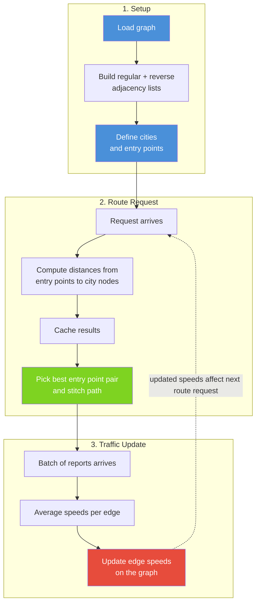

# Project Overview

```mermaid
flowchart TD
    subgraph "1. Setup"
        A[Load graph] --> B["Build regular + reverse
        adjacency lists"]
        B --> C["Define cities
        and entry points"]
    end

    subgraph "2. Route Request"
        D[Request arrives] --> E["Compute distances from
        entry points to city nodes"]
        E --> F[Cache results]
        F --> G["Pick best entry point pair
        and stitch path"]
    end

    subgraph "3. Traffic Update"
        H[Batch of reports arrives] --> I[Average speeds per edge]
        I --> J["Update edge speeds
        on the graph"]
    end

    C --> D
    G --> H
    J -.->|updated speeds affect next route request| D

    style A fill:#4a90d9,color:#fff
    style C fill:#4a90d9,color:#fff
    style G fill:#7ed321,color:#fff
    style J fill:#e74c3c,color:#fff
```
