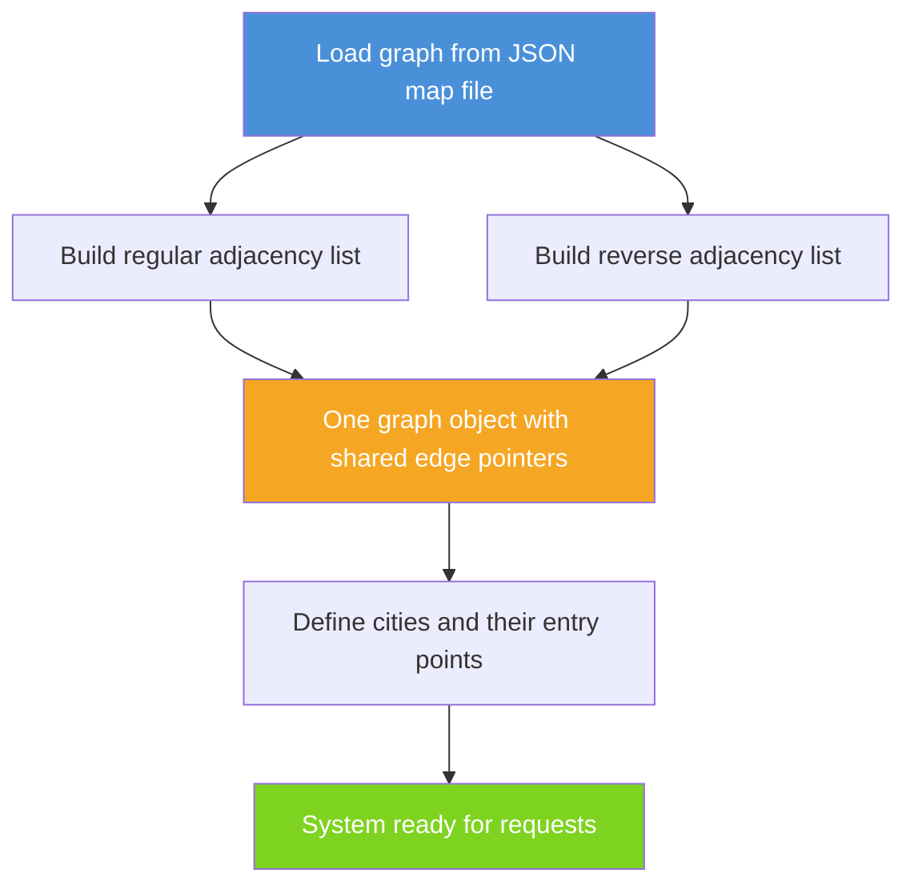
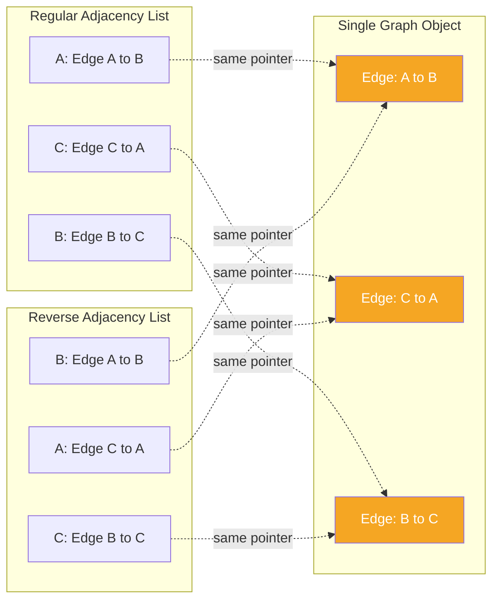
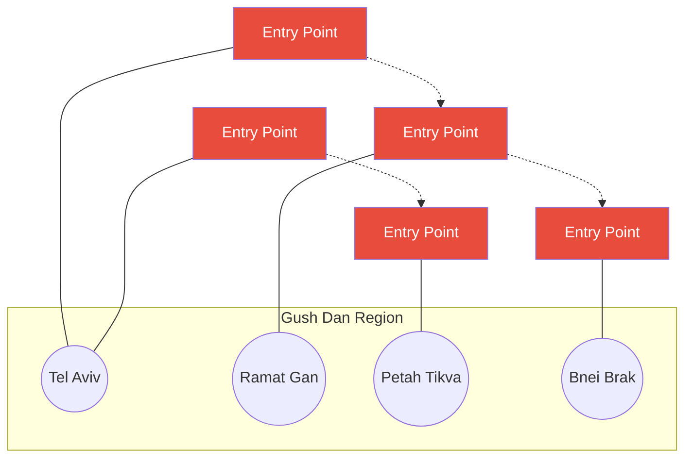

# Setup Phase

```mermaid
flowchart TD
    A[Load graph from JSON map file] --> B[Build regular adjacency list]
    A --> C[Build reverse adjacency list]
    B --> D[One graph object with shared edge pointers]
    C --> D
    D --> E[Define cities and their entry points]
    E --> F[System ready for requests]

    style A fill:#4a90d9,color:#fff
    style D fill:#f5a623,color:#fff
    style F fill:#7ed321,color:#fff
```

```mermaid
graph LR
    subgraph "Single Graph Object"
        direction TB
        E1["Edge: A to B"]
        E2["Edge: C to A"]
        E3["Edge: B to C"]
    end

    subgraph "Regular Adjacency List"
        direction TB
        RA["A: Edge A to B"]
        RC["C: Edge C to A"]
        RB["B: Edge B to C"]
    end

    subgraph "Reverse Adjacency List"
        direction TB
        XB["B: Edge A to B"]
        XA["A: Edge C to A"]
        XC["C: Edge B to C"]
    end

    RA -. same pointer .-> E1
    XB -. same pointer .-> E1
    RC -. same pointer .-> E2
    XA -. same pointer .-> E2
    RB -. same pointer .-> E3
    XC -. same pointer .-> E3

    style E1 fill:#f5a623,color:#fff
    style E2 fill:#f5a623,color:#fff
    style E3 fill:#f5a623,color:#fff
```

```mermaid
graph TD
    subgraph "Gush Dan Region"
        TA((Tel Aviv))
        RG((Ramat Gan))
        PT((Petah Tikva))
        BB((Bnei Brak))
    end

    EP1[Entry Point] --- TA
    EP2[Entry Point] --- TA
    EP3[Entry Point] --- RG
    EP4[Entry Point] --- PT
    EP5[Entry Point] --- BB

    EP1 -.-> EP3
    EP2 -.-> EP4
    EP3 -.-> EP5

    style EP1 fill:#e74c3c,color:#fff
    style EP2 fill:#e74c3c,color:#fff
    style EP3 fill:#e74c3c,color:#fff
    style EP4 fill:#e74c3c,color:#fff
    style EP5 fill:#e74c3c,color:#fff
```
