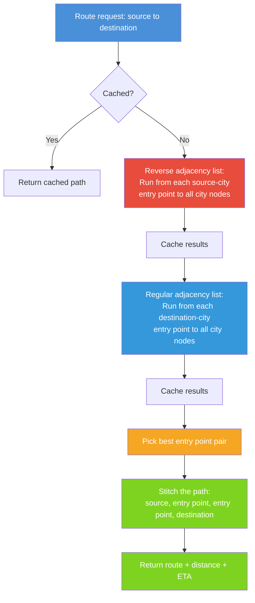
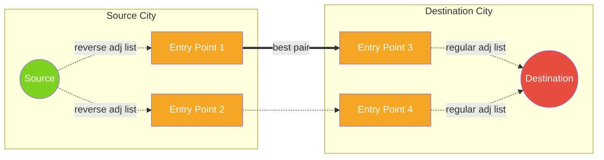
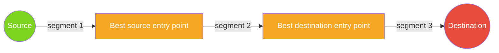

# Route Request Phase

```mermaid
flowchart TD
    A[Route request: source to destination] --> B{Cached?}
    B -- Yes --> G[Return cached path]
    B -- No --> C["Reverse adjacency list:
    Run from each source-city
    entry point to all city nodes"]
    C --> D[Cache results]
    D --> E["Regular adjacency list:
    Run from each destination-city
    entry point to all city nodes"]
    E --> F[Cache results]
    F --> H[Pick best entry point pair]
    H --> I["Stitch the path:
    source, entry point, entry point, destination"]
    I --> J[Return route + distance + ETA]

    style A fill:#4a90d9,color:#fff
    style C fill:#e74c3c,color:#fff
    style E fill:#3498db,color:#fff
    style H fill:#f5a623,color:#fff
    style I fill:#7ed321,color:#fff
    style J fill:#7ed321,color:#fff
```

```mermaid
graph LR
    subgraph "Source City"
        S((Source))
        EP1[Entry Point 1]
        EP2[Entry Point 2]
    end

    subgraph "Destination City"
        EP3[Entry Point 3]
        EP4[Entry Point 4]
        D((Destination))
    end

    S -.->|reverse adj list| EP1
    S -.->|reverse adj list| EP2
    EP3 -.->|regular adj list| D
    EP4 -.->|regular adj list| D

    EP1 ==>|best pair| EP3
    EP2 -.-> EP4

    style S fill:#7ed321,color:#fff
    style D fill:#e74c3c,color:#fff
    style EP1 fill:#f5a623,color:#fff
    style EP2 fill:#f5a623,color:#fff
    style EP3 fill:#f5a623,color:#fff
    style EP4 fill:#f5a623,color:#fff
```

```mermaid
flowchart LR
    S((Source)) -->|segment 1| EP1[Best source entry point]
    EP1 -->|segment 2| EP3[Best destination entry point]
    EP3 -->|segment 3| D((Destination))

    style S fill:#7ed321,color:#fff
    style D fill:#e74c3c,color:#fff
    style EP1 fill:#f5a623,color:#fff
    style EP3 fill:#f5a623,color:#fff
```
