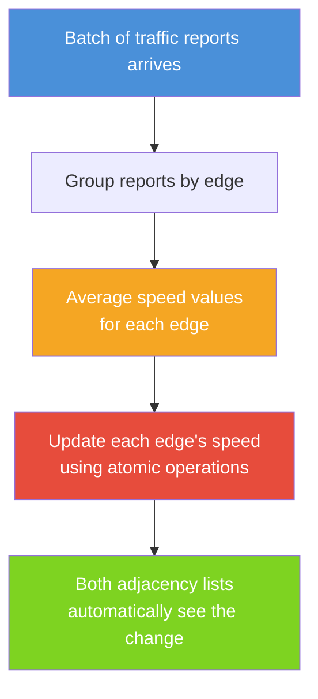
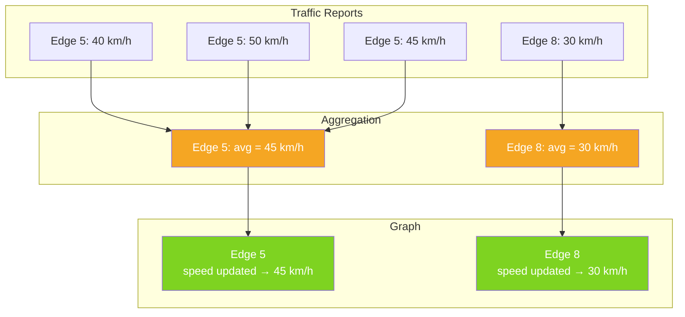

# Traffic Update Phase

```mermaid
flowchart TD
    A[Batch of traffic reports arrives] --> B[Group reports by edge]
    B --> C[Average speed values\nfor each edge]
    C --> D[Update each edge's speed\nusing atomic operations]
    D --> E[Both adjacency lists\nautomatically see the change]

    style A fill:#4a90d9,color:#fff
    style C fill:#f5a623,color:#fff
    style D fill:#e74c3c,color:#fff
    style E fill:#7ed321,color:#fff
```

```mermaid
graph TD
    subgraph "Traffic Reports"
        R1["Edge 5: 40 km/h"]
        R2["Edge 5: 50 km/h"]
        R3["Edge 5: 45 km/h"]
        R4["Edge 8: 30 km/h"]
    end

    subgraph "Aggregation"
        AVG1["Edge 5: avg = 45 km/h"]
        AVG2["Edge 8: avg = 30 km/h"]
    end

    subgraph "Graph"
        E5["Edge 5\nspeed updated → 45 km/h"]
        E8["Edge 8\nspeed updated → 30 km/h"]
    end

    R1 --> AVG1
    R2 --> AVG1
    R3 --> AVG1
    R4 --> AVG2
    AVG1 --> E5
    AVG2 --> E8

    style AVG1 fill:#f5a623,color:#fff
    style AVG2 fill:#f5a623,color:#fff
    style E5 fill:#7ed321,color:#fff
    style E8 fill:#7ed321,color:#fff
```
